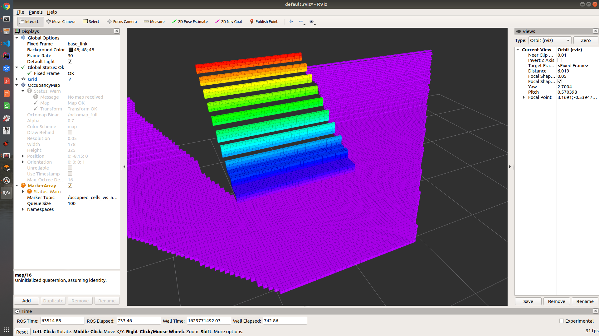

# D435 发布 HeightMap

**参考**：[velodyne_height_map](https://github.com/jack-oquin/velodyne_height_map)

# 使用教程

```shell
cd catkin_ws/src

git clone https://github.com/wadasworths/d435_heightmap.git

cd ..

catkin_make
```

需要额外安装插件

```shell
sudo apt-get install ros-melodic-octomap-server

sudo apt-get install ros-melodic-octomap-rviz-plugins
```

## octomap server


